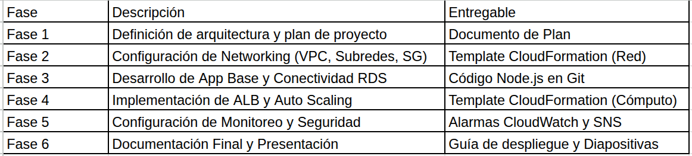

# Plan de proyecto: E-commerce escalable en AWS con IaC

## 1. Introduccion

El proyecto consiste en desplegar una plataforma de comercio electronico en AWS usando Infraestructura como Codigo con CloudFormation. La solucion cubre aplicacion web, base de datos, red, balanceo de carga, monitoreo y un flujo de pago de prueba mediante Mercado Pago Checkout Pro en sandbox.

## 2. Objetivo general

Desplegar una aplicacion web segura, reproducible y escalable en AWS, integrando servicios de red, computo, base de datos, monitoreo y automatizacion.

## 3. Objetivos especificos

- Implementar una aplicacion e-commerce con catalogo, usuarios, carrito y checkout.
- Usar RDS MySQL como base de datos administrada.
- Definir la infraestructura completa con plantillas CloudFormation.
- Separar recursos publicos y privados mediante VPC y subredes.
- Publicar la aplicacion mediante ALB y HTTPS con CloudFront.
- Configurar alertas con CloudWatch y SNS.
- Documentar el despliegue y el cumplimiento de la rubrica.

## 4. Alcance de la aplicacion

- Catalogo de productos con nombre, descripcion, precio, stock e imagenes.
- Vista previa individual por producto.
- Registro e inicio de sesion con JWT.
- Carrito de compras con agregar, eliminar y total.
- Formulario de datos de envio.
- Integracion con Mercado Pago Checkout Pro en ambiente sandbox.
- Pantalla de pedido con estado de pago, productos, total y datos de entrega.

## 5. Arquitectura cloud

- VPC dedicada con DNS habilitado.
- Dos subredes publicas para ALB y Bastion Host.
- Dos subredes privadas para aplicacion y RDS.
- Internet Gateway para subredes publicas.
- NAT Gateway para que las instancias privadas descarguen dependencias.
- Application Load Balancer publico.
- CloudFront como endpoint HTTPS usando el certificado administrado de `cloudfront.net`.
- Dos instancias EC2 privadas `t2.micro` ejecutando Node.js con PM2.
- RDS MySQL `db.t3.micro` privado.
- Bastion Host publico `t2.micro`.
- CloudWatch alarms y SNS.
- CloudTrail opcional segun permisos del sandbox.

## 6. Stack tecnologico

### Aplicacion

- Front-end: HTML, CSS, JavaScript y jQuery.
- Back-end: Node.js con Express.js.
- ORM: Sequelize.
- Autenticacion: JWT y bcrypt.
- Pagos: Mercado Pago Checkout Pro en sandbox.

### Infraestructura

- Proveedor: AWS.
- IaC: AWS CloudFormation.
- Compute: EC2.
- Balanceo: Application Load Balancer.
- HTTPS: CloudFront.
- Base de datos: RDS MySQL.
- Monitoreo: CloudWatch y SNS.

## 7. Restricciones del sandbox

- Maximo 9 instancias EC2.
- RDS permitido en clases pequenas y sin Multi-AZ.
- IAM limitado, con acciones bloqueadas por politicas del laboratorio.
- Route53 no permite registrar dominios.
- CloudTrail puede estar bloqueado segun la sesion del laboratorio.
- Auto Scaling Group no se pudo implementar en la cuenta final porque el sandbox bloqueo `LaunchConfiguration` y `LaunchTemplate`. La solucion final usa dos EC2 privadas detras del ALB como adaptacion reproducible.

## 8. Cronograma de trabajo

| Fase | Actividades | Resultado |
| --- | --- | --- |
| 1. Aplicacion base | Modelos, rutas REST, autenticacion, catalogo y carrito | App funcional localmente |
| 2. Checkout | Formulario de envio, ordenes, Mercado Pago sandbox y pantalla de confirmacion | Flujo de compra de prueba |
| 3. Networking | VPC, subredes, IGW, NAT y security groups | Red aislada |
| 4. Datos | RDS MySQL privado y conexion Sequelize | Persistencia en AWS |
| 5. Computo | EC2 privadas, ALB, CloudFront y UserData | App publicada |
| 6. Monitoreo | CloudWatch, SNS y CloudTrail opcional | Alertas y auditoria |
| 7. Documentacion | Guia, rubrica, README y preparacion de sustentacion | Entregables finales |

## 9. Recursos necesarios

- Cuenta AWS Academy Sandbox.
- AWS CLI v2 configurado.
- Repositorio GitHub publico o accesible por las instancias.
- Credenciales de prueba de Mercado Pago.
- Correo para confirmar SNS.
- Key pair `vockey` del laboratorio.

## 10. Riesgos y mitigaciones

| Riesgo | Mitigacion |
| --- | --- |
| Rollback por permisos del sandbox | Mantener plantillas simples, evitar recursos IAM nuevos y documentar restricciones. |
| CloudFront tarda en propagar | Verificar estado de la distribucion antes de probar Mercado Pago. |
| Mercado Pago rechaza `back_urls` HTTP | Usar `UseCloudFrontBaseUrl=true` para que `APP_BASE_URL` sea HTTPS. |
| Dependencias no instalan en EC2 privada | Validar NAT Gateway, rutas privadas y salida a internet. |
| CloudTrail bloqueado | Mantener parametro `EnableCloudTrail=false` y documentar la restriccion. |

## 11. Entregables

- Codigo de aplicacion en `app/`.
- Plantillas CloudFormation en `infra/`.
- Script base de dependencias en `scripts/`.
- Guia de despliegue en `docs/Guia_Despliegue_AWS.md`.
- Cumplimiento de rubrica en `docs/Cumplimiento_Rubrica.md`.
- README principal del repositorio.
- Presentacion de sustentacion con arquitectura, desafios y lecciones aprendidas.

